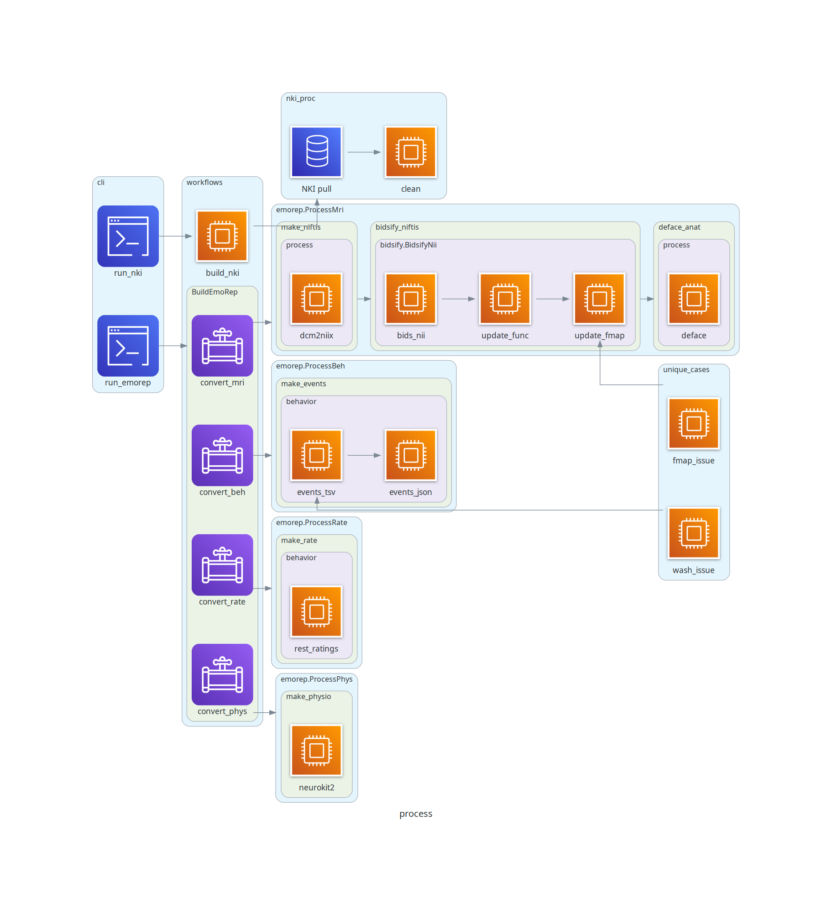
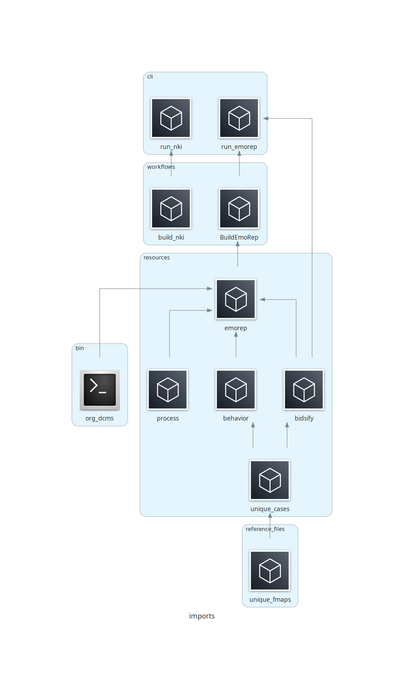

# build_rawdata
This package generates BIDS rawdata for Exp2_Compute_Emotion and Exp3_Classify_Archival via the sub-packages [build_emorep](#build_emorep) and [build_nki](#build_nki), respectively.


## Usage
- Install into project conda environment (see [here](https://github.com/labarlab/conda_labarserv2)) via `$ python setup.py install --record record.txt`
- Trigger package help and usage via entrypoint `$ build_rawdata`

```
(emorep)[nmm51-vm: ~]$build_rawdata

Version : 2.3.1

The package build_rawdata consists of sub-packages that can be accessed
from their respective entrypoints:

    build_emorep    : convert sourcedata to rawdata for Exp2_Compute_Emotion
    build_nki       : build rawdata from NKI Rockland Archival data
                        for Exp3_Classify_Archival
```

## External Requirments
- dcm2niix
- AFNI
- NeuroKit2


## build_emorep
Build BIDS rawdata directory for Exp2_Compute_Emotion using data collected by scanning for the EmoRep project.

Contents:
- [Setup](#setup)
- [Usage](#usage-1)
- [Functionality](#functionality)
- [Considerations](#considerations)


### Setup
`build_emorep` assumes the in-house `sourcedata` organization for EmoRep:

```bash
ER0009
├── day2_movies
│   ├── DICOM
│   │   └── 20220422.ER0009.ER0009
│   ├── Scanner_behav
│   └── Scanner_physio
└── day3_scenarios
    ├── DICOM
    │   └── 20220430.ER0009.ER0009
    ├── Scanner_behav
    └── Scanner_physio
```
The subdirectory of DICOM (e.g. 20220422.ER0009.ER00009) should contain all DICOMs for one session in a flat structure.

`Scanner_behav` should contain all behavior files gathered from the EmoRep [task](https://github.com/labarlab-emorep/scanner_tasks) with the following organization and naming convention:

```bash
Scanner_behav/
├── emorep_scannermovieData_ER0009_sesday2_run-1_04222022.csv
..
├── emorep_scannermovieData_ER0009_sesday2_run-8_04222022.csv
├── emorep_scannermovieData_sub-ER0009_ses-day2_run-1_04222022.mat
..
└── emorep_scannermovieData_sub-ER0009_ses-day2_run-8_04222022.mat
```

__Note:__ the file name of the CSV was changed partway through the study to have better agreement with the MAT file, e.g. `emorep_scannermovieData_sub-ER0697_ses-day2_run-1_09012023.csv`, both formats are acceptable.

`Scanner_physio` should contain all physio files gathered during the same EmoRep task with the following organization and naming convention:

```bash
Scanner_physio/
├── ER0697_physio_day2_run1.acq
..
└── ER0697_physio_day2_run8.acq
```


### Usage
Trigger this sub-package via the CLI `build_emorep`, which also supplies a help when executed without specified options:

```
(emorep)[nmm51-vm: ~]$build_emorep
usage: build_emorep [-h] [--deface] [--proj-dir PROJ_DIR] [--sub-all]
                    [--sub-list SUB_LIST [SUB_LIST ...]]

Version : 2.3.1

Build BIDS rawdata for EmoRep experiment.

Referencing data collected at the scanner, build a BIDS-organized
rawdata with NIfTIs, behavioral events, resting-state task response,
and physiological data. Optional defacing is available for NDAR
purposes and is written to derivatives.

Requires in-house EmoRep sourcedata organization.

Examples
--------
build_emorep --sub-all --deface

build_emorep \
    --sub-list ER0009 ER0016 \
    --proj-dir /path/to/project/bids \
    --deface

optional arguments:
  -h, --help            show this help message and exit
  --deface              Whether to deface via pydeface,
                        True if "--deface" else False.
  --proj-dir PROJ_DIR   Path to BIDS organized parent directory, containing sourcedata
                        and rawdata.
                        (default : /mnt/keoki/experiments2/EmoRep/Exp2_Compute_Emotion/data_scanner_BIDS)
  --sub-all             Whether to process all participant data in <proj_dir>/sourcedata,
                        True if "--sub-all" else False.
  --sub-list SUB_LIST [SUB_LIST ...]
                        List of subject IDs to submit for pre-processing,
                        e.g. "--sub-list ER4414" or "--sub-list ER4414 ER4415 ER4416".
```

It is possible to build `rawdata` for all subjects via the `--sub-all` option, or by specifying 1+ subjects via the `--sub-list` option. Using the boolean `--deface` option triggers defacing of the session anatomical file. Finally `--proj-dir` is used to specify the parent directory, containing `sourcedata` and where `rawdata` and `derivatives` will be constructed.


### Functionality
`build_emorep` conducts a series of workflows to generate BIDS-compliant `rawdata` directory using data from `sourcedata`. The steps are:

1. Setup `rawdata` and `derivatives`
1. Organize DICOMs
1. Convert DICOMs to NIfTI files via `dcm2niix`
1. BIDS-organize rawdata NIfTI files
    1. (optional) Deface anatomical NIfTI via `@afni_refacer_run` and write to `derivatives/deface`
1. Generate BIDS events TSV files from `Scanner_behav` and organize in `func`
1. Clean rest rating responses (from `Scanner_behav`) and organize in `beh`
1. Copy `Scanner_phys` ACQ files to `phys` and also generate TXT format via `NeuroKit2` for autonomate.

Also, see [Diagrams](#diagrams).


### Considerations
- `fmap` JSON files are updated with the `IntendedFor` field. If multiple `fmap` files are found then the default is to use fmap1 for EPI runs 1-4 and fmap2 for runs 5-8 + rest. If this is not appropriate then the researcher can specify the exact mapping in `build_rawdata.reference_files.unique_fmap.json`.


## build_nki
Build BIDS rawdata for Exp3_Classify_Archival (archival). This will download archival data from the Nathan Kline Institute archival dataset and BIDS-organize certain files for resting-state analyses.

Contents:
- [Setup](#setup-1)
- [Usage](#usage-2)
- [Functionality](#functionality-1)


### Setup
`build_nki` requires resources detailed [here](http://fcon_1000.projects.nitrc.org/indi/enhanced/neurodata.html), organized according to the following structure and naming scheme:

```bash
nki_resources/
├── aws_links.csv
└── download_rockland_raw_bids_ver2.py
```


### Usage
Trigger this sub-package via the CLI `build_nki`, which also supplies a help when executed without specified options:

```
(emorep)[nmm51-vm: nki_resources]$build_nki
usage: build_nki [-h] [--age AGE] [--dryrun] [--hand HAND] [--nki-dir NKI_DIR] [--proj-dir PROJ_DIR] [--protocol PROTOCOL] [--session SESSION] -t
                 SCAN_TYPE [SCAN_TYPE ...]

Version : 2.3.1

Download NKI Rockland Archival Data.

Download anatomical and resting-state EPI data from the
NKI Rockland Archive and setup a BIDS-organized rawdata
directory.

Essentially a project-specific wrapper for methods detailed at:
    http://fcon_1000.projects.nitrc.org/indi/enhanced/neurodata.html

The EmoRep project employed the method used in the first example,
and additional options are supplied for 'future-proofing'.

Examples
--------
build_nki -t anat func
build_nki -t anat func --hand R --dryrun
build_nki -t anat func --age 80 --dryrun
build_nki -t anat func --protocol REST645 --session BAS3 --dryrun

optional arguments:
  -h, --help            show this help message and exit
  --age AGE             Threshold age, will pull data for participants
                        of older (>) than specified age.
                        (default : 17)
  --dryrun              Test download parameters
  --hand HAND           ["L", "R"]
                        Handedness of participants, unspecified pulls both
  --nki-dir NKI_DIR     Path to parent directory containing download script and AWS links
                        (default : /mnt/keoki/experiments2/EmoRep/Exp3_Classify_Archival/code/nki_resources)
  --proj-dir PROJ_DIR   Path to parent directory of archival study
                        (default : /mnt/keoki/experiments2/EmoRep/Exp3_Classify_Archival)
  --protocol PROTOCOL   ["REST645", "REST1400", "RESTCAP", "RESTPCASL"]
                        Resting protocol name
                        (default : REST1400)
  --session SESSION     ["BAS1", "BAS2", "BAS3"]
                        Session, Visit name
                        (default : BAS1)

Required Arguments:
  -t SCAN_TYPE [SCAN_TYPE ...], --scan-type SCAN_TYPE [SCAN_TYPE ...]
                        ["anat", "func", "dwi"]
                        Scan type(s) to download

```

Current usage involves using the default options via the first example, and additional options are available for increased usability.


### Functionality

`build_nki` conducts a single workflow that downloads and then BIDS-organizes the NKI archival data. Data for 1000 subjects will be downloaded with default options. The steps are:

1. Download data
1. Update EPI file names with BIDS 'run' field
1. Remove accompanying physio files
1. Shorten IDs
1. Finalize BIDS organization

Also, see [Diagrams](#diagrams).


## Diagrams
Diagram of processes, showing workflow as a function of package methods.


Diagram of imports.


